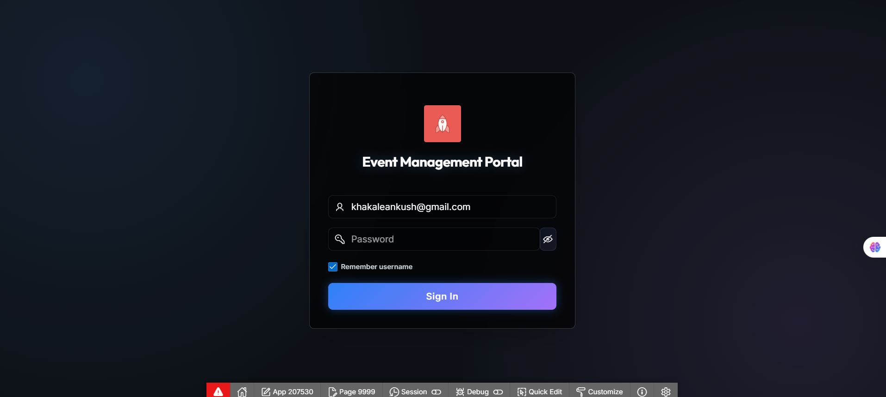
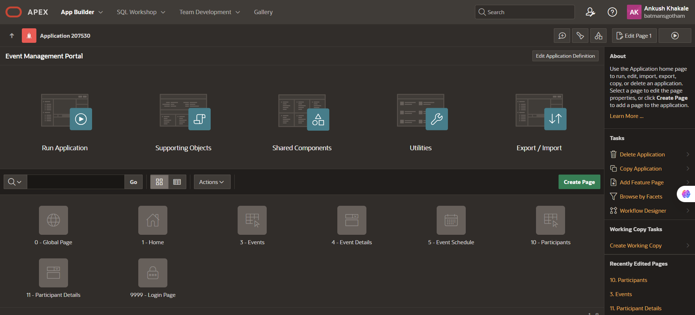
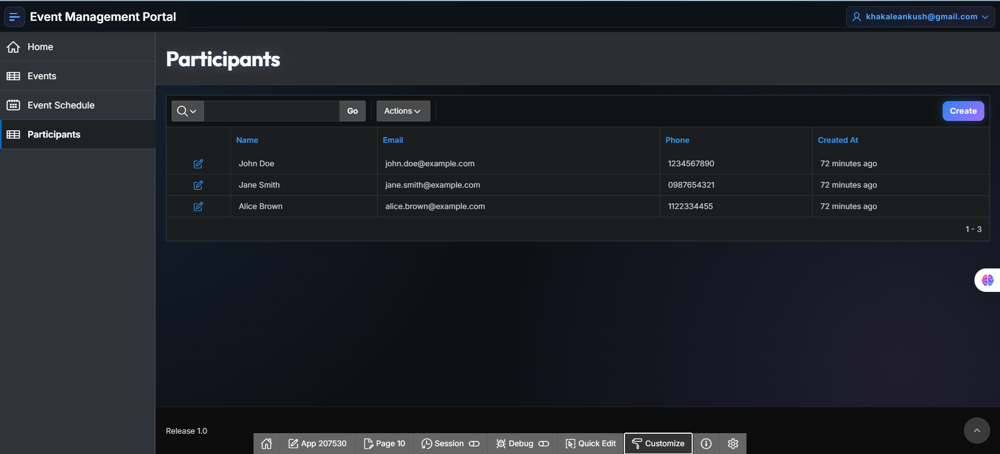

# 🎉 Event Management Portal (Oracle APEX)

[](https://apex.oracle.com/)
[](https://opensource.org/licenses/MIT)



A modern, responsive web application for managing community events, built entirely on **Oracle Cloud Infrastructure (OCI)** using **Oracle APEX**.

This project demonstrates the power of Low-Code development combined with professional SQL schema design and custom frontend styling.

---

## 🚀 Key Features

*   **Participant Management**: Register users with unique IDs and track their details.
*   **Event Scheduling**: Create, update, and delete events with a calendar view.
*   **Real-time Dashboard**: Interactive reports for tracking registrations and improved analytics.
*   **Certificate Logic**: Backend PL/SQL logic ready to generate UUID-based certificates.
*   **Modern UI**: Custom CSS/JS overrides to provide a dark-mode, glassmorphism aesthetic.

---

## 🛠️ Oracle Cloud Technologies Used

This project leverages the full stack of Oracle APEX components:

### 1. SQL Workshop (Database Design)
We used the **SQL Workshop** to design a normalized relational database schema from scratch.
*   **Object Browser**: Used to create tables (`PARTICIPANTS`, `EVENTS`, `REGISTRATIONS`) and manage constraints.
*   **SQL Commands**: Executed scripts to seed sample data and test queries.
*   **PL/SQL Packages**: Developed `pkg_event_manager` to handle complex business logic (e.g., preventing duplicate registrations, generating unique certificate IDs) directly in the database.

### 2. App Builder (Frontend Development)
The user interface was constructed using the **App Builder**.
*   **Interactive Reports**: Enabled powerful searching and filtering for event lists.
*   **Calendar Region**: Visualized event schedules.
*   **Modal Forms**: Created streamlined data entry forms for participants.
*   **Shared Components**: Managed static application files (CSS/JS) to apply a custom theme globally.



---

## 🎨 Custom Styling (Tech/Dark Theme)

While APEX provides robust defaults, we took it a step further by implementing a **Custom "Tech" Theme**:

*   **Glassmorphism**: Cards and regions feature a frosted-glass effect using `backdrop-filter`.
*   **Neon Accents**: Blue and Purple gradients to give a modern, high-tech feel.
*   **Smooth Animations**: Custom JavaScript (`IntersectionObserver`) to fade elements in as you scroll.
*   **Font Overrides**: Integrated Google Fonts (Inter & Outfit) for a premium typographic experience.

---

## 📂 Repository Structure

```text
├── docs/
│   ├── SETUP_INSTRUCTIONS.md  # Step-by-step guide to import the project
│   └── STYLING_GUIDE.md       # How to apply the custom dark theme
├── sql/
│   ├── schema.sql             # Table definitions (DDL)
│   ├── seed_data.sql          # Sample data for testing
│   └── pkg_event_manager.sql  # PL/SQL package logic
├── static/
│   ├── css/custom_styles.css  # The custom dark theme
│   └── js/animations.js       # Animation logic
└── README.md                  # This file
```

---

## ⚡ Setup Instructions

To run this project in your own Oracle APEX workspace:

1.  **Database Setup**:
    *   Open **SQL Workshop** -> **SQL Scripts**.
    *   Upload and run `sql/schema.sql`, `sql/pkg_event_manager.sql`, and `sql/seed_data.sql`.

2.  **App Creation**:
    *   Go to **App Builder** -> **Create New App**.
    *   Create pages based on the `EVENTS` and `PARTICIPANTS` tables.

3.  **Apply Styling**:
    *   Upload the files in `static/` to **Shared Components**.
    *   Link them in the **User Interface Attributes**.
    *   *(See [docs/STYLING_GUIDE.md](docs/STYLING_GUIDE.md) for full details)*.

---

## 📸 Screenshots



---

## 📜 License

This project is licensed under the MIT License - see the [LICENSE](LICENSE) file for details.
